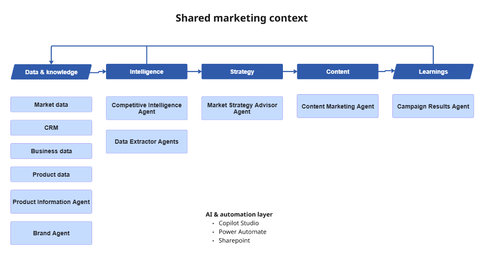

# ai-marketing-stack
An AI-enabled marketing ecosystem combining AI agents, automation, market intelligence, content development and campaign learning.

## Architecture

The AI Marketing Stack connects marketing data, intelligence, strategy, content and campaign learnings through specialized AI agents, shared context and automation.

